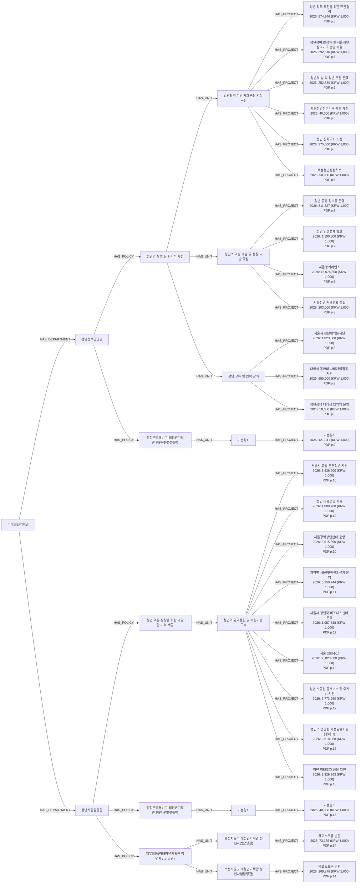

# Extracted hierarchy

Budget-v1; PDF pages 5-14. Full expense detail: knowledge-graph.json.

```mermaid
flowchart LR
n1["미래청년기획관"]
n3["청년정책담당관"]
n4["청년의 삶의 질 획기적 개선"]
n5["민관협력 기반 세대균형 시정 구현"]
n6["청년 정책 추진을 위한 민관협력<br/>2026: 874,946 (KRW 1,000)<br/>PDF p.5"]
n27["청년참여 활성화 및 서울청년참여기구 운영 지원<br/>2026: 392,610 (KRW 1,000)<br/>PDF p.6"]
n34["청년의 날 및 청년 주간 운영<br/>2026: 252,880 (KRW 1,000)<br/>PDF p.6"]
n43["서울청년참여기구 총회 개최<br/>2026: 40,000 (KRW 1,000)<br/>PDF p.6"]
n49["청년 친화도시 조성<br/>2026: 375,000 (KRW 1,000)<br/>PDF p.6"]
n54["로컬청년성장허브<br/>2026: 50,000 (KRW 1,000)<br/>PDF p.6"]
n59["청년의 역량 개발 및 성장 기반 확립"]
n60["청년 몽땅 정보통 운영<br/>2026: 511,727 (KRW 1,000)<br/>PDF p.7"]
n77["청년 인생설계 학교<br/>2026: 1,190,500 (KRW 1,000)<br/>PDF p.7"]
n85["서울영커리언스<br/>2026: 15,676,800 (KRW 1,000)<br/>PDF p.7"]
n97["서울청년 서울생활 꿀팁<br/>2026: 203,000 (KRW 1,000)<br/>PDF p.8"]
n103["청년 교류 및 협력 강화"]
n104["서울시 청년해외봉사단<br/>2026: 1,023,000 (KRW 1,000)<br/>PDF p.8"]
n112["대학생 동아리 사회기여활동 지원<br/>2026: 650,000 (KRW 1,000)<br/>PDF p.8"]
n120["청년정책 대학생 협의체 운영<br/>2026: 50,000 (KRW 1,000)<br/>PDF p.9"]
n125["행정운영경비(미래청년기획관 청년정책담당관)"]
n126["기본경비"]
n127["기본경비<br/>2026: 121,941 (KRW 1,000)<br/>PDF p.9"]
n140["청년사업담당관"]
n141["청년 역량 성장을 위한 다양한 기회 제공"]
n142["청년의 권익증진 및 자립기반 구축"]
n143["서울시 고립·은둔청년 지원<br/>2026: 3,936,500 (KRW 1,000)<br/>PDF p.10"]
n156["청년 마음건강 지원<br/>2026: 4,000,700 (KRW 1,000)<br/>PDF p.10"]
n170["서울광역청년센터 운영<br/>2026: 3,515,890 (KRW 1,000)<br/>PDF p.10"]
n181["지역별 서울청년센터 설치 운영<br/>2026: 5,150,744 (KRW 1,000)<br/>PDF p.11"]
n193["서울시 청년쿡 비즈니스센터 운영<br/>2026: 1,057,838 (KRW 1,000)<br/>PDF p.11"]
n207["서울 청년수당<br/>2026: 58,023,000 (KRW 1,000)<br/>PDF p.12"]
n215["청년 부동산 중개보수 및 이사비 지원<br/>2026: 2,773,990 (KRW 1,000)<br/>PDF p.12"]
n222["청년의 건강한 재정출발지원(영테크)<br/>2026: 2,618,368 (KRW 1,000)<br/>PDF p.12"]
n236["청년 미래투자 금융 지원<br/>2026: 3,829,963 (KRW 1,000)<br/>PDF p.13"]
n248["행정운영경비(미래청년기획관 청년사업담당관)"]
n249["기본경비"]
n250["기본경비<br/>2026: 40,388 (KRW 1,000)<br/>PDF p.13"]
n257["재무활동(미래청년기획관 청년사업담당관)"]
n258["보전지출(미래청년기획관 청년사업담당관)"]
n259["국고보조금 반환<br/>2026: 73,135 (KRW 1,000)<br/>PDF p.14"]
n264["보전지출(미래청년기획관 청년사업담당관)"]
n265["국고보조금 반환<br/>2026: 109,878 (KRW 1,000)<br/>PDF p.14"]
n1 -->|HAS_DEPARTMENT| n3
n3 -->|HAS_POLICY| n4
n4 -->|HAS_UNIT| n5
n5 -->|HAS_PROJECT| n6
n5 -->|HAS_PROJECT| n27
n5 -->|HAS_PROJECT| n34
n5 -->|HAS_PROJECT| n43
n5 -->|HAS_PROJECT| n49
n5 -->|HAS_PROJECT| n54
n4 -->|HAS_UNIT| n59
n59 -->|HAS_PROJECT| n60
n59 -->|HAS_PROJECT| n77
n59 -->|HAS_PROJECT| n85
n59 -->|HAS_PROJECT| n97
n4 -->|HAS_UNIT| n103
n103 -->|HAS_PROJECT| n104
n103 -->|HAS_PROJECT| n112
n103 -->|HAS_PROJECT| n120
n3 -->|HAS_POLICY| n125
n125 -->|HAS_UNIT| n126
n126 -->|HAS_PROJECT| n127
n1 -->|HAS_DEPARTMENT| n140
n140 -->|HAS_POLICY| n141
n141 -->|HAS_UNIT| n142
n142 -->|HAS_PROJECT| n143
n142 -->|HAS_PROJECT| n156
n142 -->|HAS_PROJECT| n170
n142 -->|HAS_PROJECT| n181
n142 -->|HAS_PROJECT| n193
n142 -->|HAS_PROJECT| n207
n142 -->|HAS_PROJECT| n215
n142 -->|HAS_PROJECT| n222
n142 -->|HAS_PROJECT| n236
n140 -->|HAS_POLICY| n248
n248 -->|HAS_UNIT| n249
n249 -->|HAS_PROJECT| n250
n140 -->|HAS_POLICY| n257
n257 -->|HAS_UNIT| n258
n258 -->|HAS_PROJECT| n259
n257 -->|HAS_UNIT| n264
n264 -->|HAS_PROJECT| n265
```